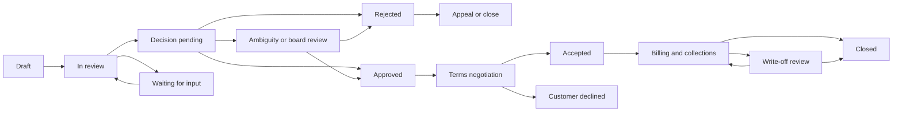

# CreditFlow Product and UX Design Doctrine

**Status:** Foundational redesign document  
**Audience:** Designers, product managers, engineers, interns, reviewers, and future maintainers  
**Purpose:** Explain what CreditFlow is trying to achieve and provide the principles needed to make good product and interface decisions without relying on tribal knowledge  
**Scope:** The complete experience from finding or creating a case through review, decision, negotiation, billing, collections, closure, audit, and policy governance

---

## Contents

1. [Authority and relationship to other documents](#0-authority-and-relationship-to-other-documents)
2. [Why this document exists](#1-why-this-document-exists)
3. [How to use this doctrine](#2-how-to-use-this-doctrine)
4. [CreditFlow in plain English](#3-creditflow-in-plain-english)
5. [The product model](#4-the-product-model)
6. [Essential vocabulary](#5-essential-vocabulary)
7. [The people using CreditFlow](#6-the-people-using-creditflow)
8. [Meta-principles](#7-meta-principles)
9. [Detailed guiding principles](#8-detailed-guiding-principles)
10. [Resolving tensions between principles](#9-resolving-tensions-between-principles)
11. [The lifecycle CreditFlow should represent](#10-the-lifecycle-creditflow-should-represent)
12. [Information architecture doctrine](#11-information-architecture-doctrine)
13. [Applying the doctrine to major experiences](#12-applying-the-doctrine-to-major-experiences)
14. [Representation doctrine](#13-representation-doctrine)
15. [Interaction and feedback doctrine](#14-interaction-and-feedback-doctrine)
16. [Responsive doctrine](#15-responsive-doctrine)
17. [Design-system grammar](#16-design-system-grammar)
18. [Trust and safety doctrine](#17-trust-and-safety-doctrine)
19. [Anti-patterns to reject](#18-anti-patterns-to-reject)
20. [Evaluating a proposed design](#19-evaluating-a-proposed-design)
21. [Experience-level success criteria](#20-experience-level-success-criteria)
22. [Final doctrine](#21-final-doctrine)

## 0. Authority and relationship to other documents

This doctrine is the primary source of truth for CreditFlow product behavior, information architecture, interaction philosophy, interface representation, and user-experience judgment.

It supersedes older screen-level decisions when those decisions conflict with the principles defined here. For example, an older document may prescribe a particular tab, button, status label, or dashboard card. That prescription should be reconsidered if it obscures ownership, misrepresents a recommendation as a decision, breaks mobile work, or conflicts with another principle in this doctrine.

This doctrine does not silently replace approved business formulas, accounting definitions, legal requirements, or security controls. Those remain authoritative within their domains. When a conflict is found:

1. identify the underlying business invariant;
2. separate the invariant from its old interface implementation;
3. preserve the invariant;
4. redesign the interface using this doctrine;
5. and record the resolved product decision so future teams do not reintroduce the conflict.

The doctrine should change only when the product's underlying goals, risks, users, or operating model change. It should not be changed merely to justify a convenient implementation.

---

## 1. Why this document exists

CreditFlow is not merely a form for calculating a credit score. It is an internal decision and operations system used to turn a commercial credit request into a controlled, explainable, auditable business outcome.

The system has many users, many states, and many numbers that look similar but mean different things. A screen can be visually attractive and still cause serious harm if it:

- lets a user misunderstand whether terms are requested, recommended, approved, or accepted;
- makes an important task difficult to find;
- hides who currently owns the case;
- shows an action without explaining its consequence;
- lets an exception look like an ordinary case;
- presents stale or incomplete information as current truth;
- makes a reviewer reconstruct the decision from six different tabs;
- or makes the interface appear successful when the underlying workflow failed.

This document provides a shared way of thinking about those problems.

It is deliberately **not an SOP**. It does not tell a designer to place a button at a particular pixel or tell an engineer which line of code to change first. Those instructions become obsolete as the product evolves. Instead, this document explains the truths, priorities, and decision tests that should remain valid even when the implementation changes.

A person with no previous knowledge of the product should be able to read this document and understand:

1. what business problem CreditFlow solves;
2. who uses it and what each person is trying to accomplish;
3. how a case moves through its lifecycle;
4. what information must be represented and why;
5. what makes a flow safe, clear, and trustworthy;
6. how to judge whether a proposed design is good;
7. and how to resolve common design trade-offs without waiting for a product expert.

---

## 2. How to use this doctrine

Use this document before creating or reviewing any CreditFlow experience.

It should help answer questions such as:

- Should this information appear on the dashboard, the case page, or both?
- Should this action be visible to this role?
- Is this status understandable to a business user?
- Is the interface showing a recommendation or a final decision?
- What should happen when required information is missing?
- Is a confirmation needed?
- What must be visible on mobile?
- Should a user see a raw score, a summary, or neither?
- Is the user looking for a record or trying to complete work?
- Does a screen help the user act, or does it merely display data?

When principles appear to conflict, use the following priority order:

1. **Protect financial, customer, and decision integrity.**
2. **Show the truth of the current state.**
3. **Make ownership and the next valid action obvious.**
4. **Give the user enough context to act responsibly.**
5. **Minimize effort and cognitive load.**
6. **Create visual elegance and delight.**

Visual polish is important, but it never outranks truth, safety, or actionability.

---

## 3. CreditFlow in plain English

### 3.1 The business situation

A Relationship Manager wants to offer a customer or contractor commercial credit. The business must decide:

- whether credit should be offered;
- how much exposure is acceptable;
- for how many days;
- on what tranche schedule;
- what evidence supports the decision;
- who approved it;
- whether the customer accepted the terms;
- whether the promised money was collected on time;
- and what happened when reality differed from the plan.

Without a system, this process can become relationship-driven, inconsistent, difficult to audit, and easy to manipulate after the fact.

CreditFlow replaces that informal process with a controlled lifecycle.

### 3.2 The simplest possible product definition

> CreditFlow helps the right employee make the right credit-related decision at the right time, using the right evidence, while preserving an exact history of what was requested, recommended, approved, accepted, billed, collected, changed, and closed.

### 3.3 What the product is not

CreditFlow is not:

- a public customer portal;
- a generic CRM;
- a spreadsheet replacement with prettier cards;
- a black-box score calculator;
- a document repository;
- an ERP or bank reconciliation system;
- or a dashboard whose primary purpose is to look impressive.

It may integrate with or link to those systems, but its core responsibility is the controlled credit lifecycle.

### 3.4 The central product promise

At any moment, an authorized user should be able to determine:

- what the case is;
- where it is in the lifecycle;
- what has already happened;
- what is true now;
- who owns the next step;
- what that person must do;
- when it is due;
- what evidence and policy support the decision;
- and what consequence will follow from the next action.

If the product cannot answer these questions, it is not yet doing its job.

---

## 4. The product model

### 4.1 The case is the enduring business record

A **credit case** represents one commercial request. It contains the parties, requested exposure, proposed payment terms, ownership, business context, final terms, billing state, and ultimate outcome.

The case survives across many activities. It must not be confused with a single form submission, task, score, review cycle, approval round, or payment.

### 4.2 A review cycle is one evaluation of the case

A case may be reviewed more than once. Each **review cycle** represents one evaluation under one frozen policy context.

A material change should create a new review cycle rather than silently rewriting the historical one. Examples include a changed party, changed bill amount, materially changed exposure, or a reopened decision that requires rescoring.

### 4.3 Stages organize evidence collection

Stages exist to collect and validate information in a controlled sequence. A stage contains tasks owned by specific roles. Completing a stage is not itself a credit approval. It means the evidence required at that stage is ready for the next system-controlled transition.

### 4.4 An approval round is a frozen decision moment

An **approval round** captures who was expected to decide, what information they saw, what the recommended terms were, what each authorized approver decided, and the final result.

It is a snapshot, not a live window into mutable future data.

### 4.5 A board round is an exception decision

A **board round** exists for ambiguity, appeal, or another governed exception. It is not simply a more colorful approval form. It requires an independent roster, a voting window, a frozen decision packet, a deterministic decision basis, and explicit override governance.

### 4.6 Billing and collections measure reality

Approval describes what the company permits. Accepted terms describe what the customer agrees to. Billing and collections describe what actually happens.

The product must preserve these as separate truths instead of overwriting earlier values with later ones.

---

## 5. Essential vocabulary

The following words must be used consistently throughout the product.

| Term | Meaning | Must not be confused with |
|---|---|---|
| Case | The complete commercial credit record | A review cycle or approval round |
| Party | A customer, contractor, or influencer linked to a case | A user of CreditFlow |
| Bill amount | The gross commercial bill value presented at intake | Exposure or collected amount |
| Requested exposure | The portion of the commercial value for which credit is requested | Bill amount |
| Requested terms | The tranche schedule proposed by the RM | Policy recommendation |
| Composite days | The weighted credit days represented by a tranche schedule | A final approval by itself |
| Policy recommendation | The score-band or rule-based output produced by the policy engine | Approved terms |
| Approved terms | The terms formally authorized through the approval process | Customer acceptance |
| Accepted terms | The final terms accepted in commercial negotiation | Approved terms when the customer has not accepted |
| Decided amount | The final commercial amount used as the margin baseline | Promised amount |
| Promised amount | The amount the customer commits to pay and collections measure against | Collected amount |
| Collected amount | The sum of valid payment entries received | Promised amount |
| Outstanding amount | Promised amount minus valid collected amount, adjusted by approved credit notes | Bill amount |
| Tranche | One scheduled portion of payment with an amount and due date | A repayment entry |
| Task | A required unit of work owned by a role or person | A notification |
| Work item | Any actionable item requiring a user response, including a task, approval, vote, collection follow-up, or admin exception | A passive record |
| SLA | The time expectation for completing work | A decorative countdown |
| Waiting | A controlled state in which progress is blocked by an identified dependency | General inactivity |
| Ambiguity | A governed signal that information, score, policy application, or missing evidence prevents an ordinary deterministic decision | A vague warning badge |
| Override | An authorized decision that intentionally differs from the normal policy or vote result | An ordinary edit |
| Audit event | An immutable record of a meaningful action, change, or sensitive view | A debug log |

If a proposed label cannot be mapped cleanly to this vocabulary, the label should be challenged before it enters the interface.

---

## 6. The people using CreditFlow

### 6.1 Relationship Manager (RM)

The RM originates the commercial request and owns the relationship context.

The RM needs to:

- create a case even when some information is incomplete;
- find and reuse trustworthy party information;
- understand which fields are required and why;
- see whether a case is progressing or blocked;
- respond to returned questions;
- understand the business outcome without seeing unnecessarily sensitive scoring internals;
- negotiate accepted terms within approved limits;
- hand the approved case into billing;
- and understand collection outcomes that affect portfolio performance.

The RM should not need to understand database stages, policy table IDs, or internal implementation mechanics.

### 6.2 Key Account Manager (KAM)

The KAM coordinates execution across review and collections.

The KAM needs to:

- triage newly submitted cases;
- confirm or change operational classifications through governed controls;
- assign work to the correct people;
- see blockers, missing evidence, and approaching SLAs;
- submit completed stages;
- manage exceptions without bypassing accountability;
- coordinate negotiation and billing handoff;
- log or supervise collections;
- manage promises to pay and escalations;
- and preserve a clean operational record.

The KAM experience should feel like a work console, not a collection of case files.

### 6.3 BDO and Accounts contributors

BDO and Accounts users perform focused tasks. They often need mobile access and should not be forced to understand the entire workflow.

They need to see:

- the case summary necessary for their task;
- the exact question or validation requested;
- the rubric or evidence expectation;
- the deadline;
- relevant documents and prior values;
- and a clear submit, wait, or return action.

Their experience should be narrow, fast, and safe.

### 6.4 Ordinary Approver

The approver is responsible for an explicit decision, not merely acknowledging a score.

The approver needs:

- a complete but concise decision packet;
- requested versus recommended terms;
- top risk and positive drivers;
- current and historical exposure;
- data freshness and missing evidence;
- material changes since prior review;
- prior approval history where appropriate;
- a deadline;
- and structured approve, reject, or return-for-revision choices.

The approver should not have to reconstruct the case by opening every tab.

### 6.5 Board Member

The board member handles an exception under a time-bound, independent voting process.

The board member needs:

- the reason the case reached the board;
- a frozen evidence packet;
- the unresolved issues;
- the KAM or approver recommendation;
- a private voting experience while the window is open;
- the deadline and quorum rules;
- and the final recorded outcome after closure.

Other voters' choices should not bias an open vote unless the governance model explicitly requires deliberative voting.

### 6.6 Founder or Administrator

The administrator manages exceptional authority and system governance.

The administrator needs to:

- resolve write-offs and credit notes;
- manage users and roles safely;
- govern party merges;
- configure and publish policies;
- understand the consequences of configuration changes;
- inspect sensitive audit history;
- and intervene when the ordinary workflow cannot resolve an issue.

Administrative power should make consequences more explicit, not make the interface less careful.

### 6.7 Multi-role users

A person may hold more than one legitimate role. CreditFlow should not pretend that only the first role exists.

The interface may provide a "View as" context to focus the workspace, but authorization must use the union of the person's real roles. The active view changes information emphasis; it does not create or remove authority.

---

## 7. Meta-principles

Meta-principles govern how the more specific design principles should be interpreted.

### 7.1 Design for the business consequence, not the database operation

An interface action should be described by what it means to the business.

For example:

- "Submit Stage 1" is better than "Update active_stage."
- "Return for missing bank statement" is better than "Set status to In Review."
- "Approve write-off of ₹1,20,000" is better than "Close case."

The database operation is an implementation detail. The user is taking responsibility for a business consequence.

**Failure mode:** The interface mirrors table names, IDs, and status fields. Users must learn the implementation to operate the product.

**Decision test:** Can a domain expert understand the action without knowing how the database is structured?

### 7.2 The system should make the correct path easier than the incorrect path

Good design is not limited to showing an error after the user makes a mistake. It structures choices so that the valid action is obvious and invalid actions are unavailable or clearly explained.

This includes:

- showing one primary next action instead of multiple conflicting transitions;
- requiring selection of a returned field rather than accepting a vague revision request;
- deriving related IDs from the case instead of asking the user to provide them;
- and preventing a financial decision from being submitted without seeing its impact.

**Failure mode:** The interface exposes every technically possible action and relies on users to know which one is legal.

**Decision test:** If a new but authorized user follows the visual hierarchy, will the system lead them toward the valid business outcome?

### 7.3 Absence of information is itself information

Missing data, stale data, an empty roster, an unassigned task, and an unknown score band are not neutral states. They can change the safety of a decision.

The product must not quietly convert unknown into zero, normal, approved, or complete.

**Failure mode:** A missing value is rendered as a harmless dash while the workflow proceeds as if the value were verified.

**Decision test:** Does the screen distinguish "not applicable," "not yet provided," "failed to load," "stale," and "verified zero"?

### 7.4 Every exception deserves a modeled state

Exceptions should not survive only as comments or audit text. Waiting, ambiguity, appeal, override, write-off, credit note, stale evidence, and forced readiness are business states with owners and resolution paths.

**Failure mode:** A user must read free-text comments to discover that ordinary progression is unsafe.

**Decision test:** Can the exception be found, filtered, assigned, measured, and resolved without reading every note?

### 7.5 The interface is not the security boundary

Hiding a button is useful for clarity, but it does not create authorization. Server and database layers must independently verify role, ownership, record relationships, state, and permitted transition.

The UX should reflect true permissions, while the backend must enforce them.

**Failure mode:** A sensitive action is considered protected because a component checks `activeRole` before rendering it.

**Decision test:** If the request were sent without the interface, would the system still reject an unauthorized or invalid action?

### 7.6 A user should not need tribal knowledge to interpret the screen

A term, color, number, or workflow should be understandable from the interface and its supporting guidance.

This does not mean explaining everything at all times. It means providing definitions, context, provenance, and progressive detail where misunderstanding would matter.

**Failure mode:** Experienced employees can operate the system only because another employee taught them what "Approved Days" really means in each state.

**Decision test:** Can a trained intern explain the meaning and source of every prominent value on the screen?

---

## 8. Detailed guiding principles

### Principle 1: State before action

#### Meaning

Before asking a user to act, establish the exact state of the case and why the action is available.

Every action area should communicate:

- the current macro phase;
- the specific workflow state;
- the current owner;
- the condition that made the action available;
- and the likely next state.

#### Why it matters

The same action label can have different consequences in different states. "Approve" during an ordinary round is different from "Approve" during a board override. "Close" after full collection is different from approving a write-off.

#### Good application

> **Pending your approval**  
> Stage 2 evidence is complete. Policy recommends 30 days against 45 requested. Decision due tomorrow.  
> [Review and decide]

#### Bad application

> Status: Awaiting Approval  
> [Approve] [Reject] [Return]

#### Common failure modes

- Status is displayed only as a colored badge.
- The screen shows actions but not why they are enabled.
- The user sees both "Progress Stage" and "Request Approval."
- The action is placed far away from the information needed to judge it.

#### Design test

Ask: "If I hide the action buttons, can I still explain what is happening and why?" If not, the state representation is insufficient.

---

### Principle 2: Ownership before completeness

#### Meaning

A case can contain extensive information and still be unusable if nobody knows who must act next.

The interface should prioritize ownership at three levels:

1. business owner of the case;
2. owner of the current stage or decision;
3. assignee of the immediate work item.

#### Why it matters

Unowned work ages silently. A generic status such as "In Review" does not help the RM, KAM, or Accounts team understand who is responsible.

#### Good application

> Waiting on Accounts · Priya Nair  
> Validate audited financials · Due 19 Jul

#### Common failure modes

- "Unassigned" appears without an escalation or assignment action.
- A dashboard shows case counts but not owned work.
- Notifications are used as a substitute for a task queue.
- Assignment is shown only inside the case, making workload impossible to manage.

#### Design test

For every nonterminal case, identify one primary next owner. If the answer is "everyone" or "the team," the workflow is underspecified.

---

### Principle 3: One authoritative next action

#### Meaning

At any ordinary point in the workflow, the interface should emphasize one primary valid action for the current user. Secondary actions may exist, but they must not compete with or contradict the main path.

#### Why it matters

Users should not be required to understand the internal transition graph. The system should evaluate completed tasks, routing rules, approval requirements, and exceptions to determine the next valid transition.

#### Examples

- "Continue intake" rather than separate navigation around invalid steps.
- "Submit stage" rather than both "Progress" and "Request approval."
- "Review decision packet" rather than placing approve/reject in the case header.
- "Resolve write-off" rather than generic "Close."

#### Tension

Experts sometimes want shortcuts. Shortcuts are acceptable when they preserve the same rules, communicate consequences, and do not introduce alternative unofficial workflows.

#### Design test

If two primary-looking actions can send the record to different lifecycle states, explain why both are simultaneously valid. If that explanation is difficult, the design is likely wrong.

---

### Principle 4: Separate proposed, recommended, approved, accepted, and realized truth

#### Meaning

CreditFlow contains several layers of truth. They must never be collapsed into one mutable "current value."

The key layers are:

1. **Requested** — what the RM proposes.
2. **Recommended** — what policy and scoring produce.
3. **Approved** — what the authorized decision grants.
4. **Accepted** — what the customer agrees to.
5. **Realized** — what is billed and collected.

#### Why it matters

Calling a score-band output "Approved Days" before an approver acts can change behavior and create false authority. Overwriting requested terms with accepted terms destroys the ability to understand negotiation and policy performance.

#### Preferred representation

| Layer | Amount/terms | Status |
|---|---|---|
| Requested | ₹10L exposure · 45 days | Submitted by RM |
| Policy recommendation | 30 days | Based on Policy v3.2 |
| Approved | 35 days | Approved by Anil, 18 Jul |
| Accepted | 30/60 split · 32 composite days | Accepted by customer |
| Realized | ₹6L collected · ₹4L outstanding | Billing active |

#### Common failure modes

- One field changes meaning as the case progresses.
- "Approved" is used for a recommendation.
- The case list shows requested days for some statuses and calculated days for others without labeling the distinction.
- Billing values overwrite the decision record.

#### Design test

Can the interface answer "What did we ask for, what did policy suggest, what did we authorize, what did the customer accept, and what actually happened?" without consulting the audit log?

---

### Principle 5: Explain the decision, not just the score

#### Meaning

A score is a supporting signal. It is not a complete explanation and should never be the only prominent representation of risk.

When a role is permitted to view scoring details, the interface should communicate:

- what the score measures;
- whether higher or lower is safer;
- the policy version;
- the strongest positive drivers;
- the strongest negative drivers;
- missing critical inputs;
- data freshness;
- score changes across stages;
- and how the score mapped to a recommendation.

#### Role sensitivity

- RM sees a business-facing outcome and actionable missing information, not internal weighting logic.
- Task contributors see only the scoring context necessary for their assigned input.
- KAM sees operational scoring progress and ambiguity reasons.
- Approvers and board members see the complete decision explanation.
- Admin sees configuration and calculation detail.

#### Common failure modes

- A card shows "Score 62/100" with no legend.
- A green or red color implies safety without explaining the scale.
- The score changes without showing which input changed.
- The interface exposes raw weights to users who should not be influenced by them.

#### Design test

Ask a reviewer to explain the recommendation without repeating the numeric score. The design should make that possible.

---

### Principle 6: Work queues are for action; lists are for retrieval

#### Meaning

CreditFlow needs both operational queues and searchable records. They solve different problems.

A **work queue** answers:

- What needs me?
- What is most urgent?
- Why is it here?
- When is it due?
- What action should I take?

A **case list** answers:

- Can I find a known or related case?
- Can I compare records?
- Can I browse by status, party, owner, amount, or date?

#### Why it matters

Trying to use a status-filtered case list as a task queue produces hidden urgency, unclear ownership, and manual scanning.

#### Queue ordering

Default priority should consider:

- breached SLA;
- near deadline;
- financial exposure;
- broken promise to pay;
- unresolved critical input;
- exception severity;
- and time since last meaningful action.

Chronological creation date alone is rarely enough.

#### Common failure modes

- "Recent Activity" means recently created records.
- A metric says "12 urgent" but links to an unfiltered list.
- Counts are based on a limited result array rather than exact totals.
- Notifications are presented as "My Tasks."

#### Design test

Can a user start the day and identify the three most important actions without opening multiple cases?

---

### Principle 7: Progressive disclosure must follow role and lifecycle

#### Meaning

Show enough information for the user to understand and act, then reveal deeper detail when it becomes relevant.

Progressive disclosure has two dimensions:

1. **Role:** different users need different depth.
2. **Lifecycle:** different phases make different information important.

#### Examples

- Ledger is secondary during intake and primary during billing.
- Audit history is available but not the default work surface for an RM.
- A BDO sees the task and necessary case context, not the complete board record.
- An approver sees a decision brief before the underlying full evidence.

#### Common failure modes

- Every role sees the same six tabs.
- Every future stage is fully expanded.
- Sensitive scoring appears because it is technically available.
- Irrelevant actions remain visible and later fail.

#### Tension

Progressive disclosure must not become concealment. Users need a clear path to supporting evidence and provenance.

#### Design test

For every prominent element, ask: "Why does this role need this information in this lifecycle phase?"

---

### Principle 8: Context must travel with the work

#### Meaning

Users should not repeatedly reconstruct context as they move from dashboard to case to task to approval.

A work item should carry:

- case identity;
- party;
- commercial size;
- current phase;
- reason for the work;
- deadline;
- and a deep link to the exact action surface.

Returned work should carry the exact fields or evidence requiring revision. Notifications should link directly to the relevant task, decision, comment, or financial exception.

#### Common failure modes

- A notification says "Case returned" and opens the generic overview.
- An approver opens the case and must navigate to the correct approval round.
- Comments contain the only explanation for a returned case.
- A collections alert opens all cases rather than the overdue tranche.

#### Design test

Count how many navigation and interpretation steps occur between seeing an alert and reaching the exact work. Reduce steps that add no decision context.

---

### Principle 9: Exceptions must be conspicuous, specific, and resolvable

#### Meaning

An exception is more than a warning color. It must include:

- the exception type;
- the condition that caused it;
- the affected values or evidence;
- the owner;
- the allowed resolution paths;
- the deadline;
- and the historical record.

#### Examples

- Missing critical bank statement.
- Exposure data is 45 days old.
- Case force-readied with two incomplete tasks.
- Vote tied at board close.
- Payment shortfall exceeds write-off threshold.
- Credit note would reduce promised amount below collected amount.

#### Common failure modes

- A generic "Ambiguous" badge with no reasons.
- A write-off action with no shortfall or margin impact.
- Waiting without a waiting reason or expected responder.
- An override represented as an ordinary edit.

#### Design test

Can a user resolve the exception from the information and actions presented, or does the warning merely announce a problem?

---

### Principle 10: High-consequence actions require consequence previews

#### Meaning

The more difficult an action is to reverse, the more clearly the interface must communicate its effect before submission.

Examples include:

- rejecting a case;
- finalizing a board decision;
- publishing a policy;
- approving a write-off;
- approving a credit note;
- deleting or correcting a payment;
- merging parties;
- revoking a role;
- cancelling billing;
- or withdrawing a case.

#### A good consequence preview answers

- What record will change?
- From what state to what state?
- What amount or terms are affected?
- Who will be notified?
- Can the action be reversed?
- What reason will be preserved?
- Will a new review cycle be required?

#### Confirmation quality

Avoid generic confirmations such as "Are you sure?" Prefer:

> Approve write-off of ₹1,20,000 for CASE-1042?  
> The case will close with a shortfall, RM margin will be recalculated, and the decision will be permanently audited.  
> Reason: Customer insolvency

#### Design test

Could a careful user accurately describe the consequence before pressing the final button?

---

### Principle 11: Drafting should reduce commitment, not postpone saving

#### Meaning

A draft allows useful partial work to be preserved without claiming that the case is ready for review.

The user should be able to save from any meaningful point in intake. Submission, not saving, should enforce complete review readiness.

#### Draft behavior

- Autosave where safe.
- Show last saved time and save state.
- Allow incomplete fields.
- Preserve the user's place.
- Mark missing requirements clearly.
- Require KAM assignment and submission-critical fields only when submitting.
- Warn before leaving with unsaved work.

#### Common failure modes

- "Save as Draft" exists only on the final step.
- Draft creation requires every field needed for submission.
- A failed later operation leaves an invisible partial draft.
- Users create placeholder or false values just to save.

#### Design test

Can an RM create a legitimate partial case in under a minute when only the party and rough request are known?

---

### Principle 12: Data provenance and freshness are part of the value

#### Meaning

Credit data is only trustworthy when users know where it came from and when it was captured.

Reusable party answers, imported exposure, payment history, policy outputs, and documents should show provenance appropriate to their importance.

Examples:

- "Imported from ERP · data as of 15 Jul."
- "Reused from CASE-1004 · confirmed 03 Jun by Kavya."
- "Policy recommendation · v3.2 published 01 Jul."
- "Payment logged by Rahul · 18 Jul 14:22 IST."

#### Freshness behavior

Freshness should be represented semantically:

- current;
- aging but usable;
- stale and requiring confirmation;
- unavailable;
- or failed to load.

#### Common failure modes

- A reused value silently appears as if newly entered.
- Stale exposure is shown alongside live values without distinction.
- A missing query renders as "No history."
- The audit log is the only place provenance can be found.

#### Design test

Can the user identify the source and effective date of every material decision input?

---

### Principle 13: Feedback must confirm the business outcome, not only the interaction

#### Meaning

After an action, tell the user what actually happened in the workflow.

Good feedback includes:

- success or failure;
- the new state;
- the next owner;
- the next expected event;
- and a durable path to the result.

#### Examples

> Stage submitted. The case is now awaiting ordinary approval from Meera Shah. Due 20 Jul.

> Payment of ₹2,00,000 recorded. Tranche 1 is paid; ₹80,000 was allocated to Tranche 2. Case remains Billing Active.

> Case returned to RM. Three fields require revision. SLA restarts when the RM resubmits.

#### Common failure modes

- A dialog closes before the server action succeeds.
- The page redirects without a receipt.
- Optimistic UI shows a completed financial or approval action that later fails.
- Success means only that a request was sent, not that the transition committed.

#### Design test

After submission, can the user answer "What state is the case in now and who acts next?"

---

### Principle 14: Mobile design should preserve the work, not the desktop layout

#### Meaning

Mobile is an important task surface for BDO, Accounts, comments, summaries, and basic approvals. It should not be a desktop layout compressed into a narrow viewport.

#### Mobile priorities

- case identity and status;
- one primary next action;
- assigned task context;
- form controls and evidence links;
- comments and mentions;
- approval summary and basic decision actions;
- notifications;
- and collection follow-up where operationally required.

#### Mobile behavior

- Replace the fixed sidebar with a drawer or compact navigation.
- Use one-column layouts.
- Make the primary action sticky when appropriate.
- Convert wide tables into summary cards or horizontally scrollable data regions with clear affordance.
- Use full-screen sheets for complex task forms.
- Keep touch targets at least 44 by 44 CSS pixels.
- Never rely on hover.

#### Common failure modes

- A 256px sidebar remains visible on a 390px screen.
- An inline task form is squeezed into a table row.
- Important actions disappear because they were desktop-only.
- Board columns require drag and drop without an alternative.

#### Design test

Can an assigned BDO complete a realistic task on a 390px-wide device without zooming, horizontal page scrolling, or losing case context?

---

### Principle 15: Accessibility is operational reliability

#### Meaning

Accessibility is not a separate compliance layer. It improves accuracy, keyboard operation, touch use, screen-reader interpretation, and resilience under stress.

#### Required qualities

- Use semantic controls for interaction.
- Associate labels with fields.
- Provide visible focus.
- Preserve logical focus order.
- Give icon-only controls accessible names.
- Do not use color as the only status signal.
- Support keyboard operation for every action.
- Respect reduced-motion preferences.
- Make errors programmatically associated with fields.
- Announce important asynchronous results.

#### Common failure modes

- Clickable `div` elements are used as wizard steps.
- A bell icon has no accessible name.
- Mark-as-read appears only on hover.
- Red and green are the only difference between reject and approve.
- A chart has no textual interpretation.

#### Design test

Can the complete flow be understood and operated with a keyboard and screen reader, and can status be understood without color?

---

### Principle 16: Operational interfaces should be calm, dense where useful, and free of decorative competition

#### Meaning

CreditFlow is used repeatedly for consequential work. The visual system should build confidence, not demand attention for its own sake.

#### Desired character

- restrained;
- clear;
- stable;
- information-rich without clutter;
- explicit about urgency;
- and consistent across roles.

Animation should explain change, preserve orientation, or confirm progression. It should not make routine metrics perform for the user on every visit.

#### Common failure modes

- Multiple animated cards compete with urgent work.
- Every badge uses a saturated color.
- Decorative effects reduce text contrast.
- Important warnings look like ordinary cards.
- Dense operational pages have no hierarchy.

#### Design test

After the novelty disappears, does the design help a user work faster and more accurately for several hours a day?

---

### Principle 17: Configuration should be powerful but comprehensible

#### Meaning

Policy administrators need configuration flexibility without editing raw implementation structures.

Rules should be represented in business language, validated before publication, and testable through examples.

#### Good policy experience

- An active policy is immutable.
- A draft is cloned from the active policy.
- Draft context is always visible.
- Modules are grouped by business purpose.
- Rules use a visual condition builder where possible.
- Completeness and conflict checks run continuously.
- Simulation uses the same engine as production.
- Publishing shows impact, validation, and effective version.

#### Common failure modes

- The user edits raw JSON.
- Draft pages accidentally modify active policy.
- Simulation uses a separate simplified formula.
- Publishing is a one-click state flip with no validation.
- A configuration page exposes database UUIDs.

#### Design test

Can an authorized business administrator predict what cases will be affected and verify the result before publishing?

---

### Principle 18: Auditability should be human-readable by default

#### Meaning

The audit record must be immutable and complete, but completeness does not require showing raw JSON to ordinary reviewers.

An audit event should communicate:

- what happened;
- who did it;
- when;
- the actor's role or authority context;
- the before and after values;
- the reason;
- the related decision or task;
- and whether the action was an exception or override.

#### Preferred representation

> **Promised amount changed**  
> ₹8,50,000 → ₹8,20,000  
> By Ananya Sharma · KAM · 18 Jul, 14:22 IST  
> Reason: Approved credit note for damaged goods

Raw structured data may remain available behind a technical-detail control for administrators.

#### Design test

Can a business reviewer understand the history without reading JSON or database IDs?

---

## 9. Resolving tensions between principles

Good product decisions often involve two legitimate goals that pull in different directions. The answer is rarely to ignore one goal. Use the guidance below to preserve the intent of both.

### 9.1 Speed versus control

CreditFlow should reduce unnecessary effort, but high-consequence actions must remain deliberate.

Use this rule:

- make frequent, reversible, low-risk work fast;
- make infrequent, irreversible, financial, or authority-changing work explicit.

Examples:

- Saving an intake draft should be immediate and unobtrusive.
- Assigning an ordinary task may need lightweight confirmation or none.
- Rejecting a case requires structured rationale and a consequence preview.
- Publishing policy or approving a write-off requires stronger review and confirmation.

Do not measure efficiency only by number of clicks. A confirmation that prevents a ₹10 lakh error is not waste. Repeated navigation that provides no additional understanding is waste.

### 9.2 Transparency versus confidentiality

The product should explain decisions without exposing information a role should not see.

Use progressive disclosure and role-specific explanation:

- RM receives a business outcome, missing-information request, and permitted negotiation range.
- Task contributors receive only the context needed for their task.
- Approvers receive decision drivers and policy rationale.
- Administrators receive calculation and configuration detail.

Do not solve confidentiality by making the interface mysterious. If information is intentionally hidden, provide the highest-level explanation the role is permitted to receive.

### 9.3 Consistency versus role tailoring

The same concepts should look and behave consistently, while the information emphasis should change by role.

Preserve:

- shared vocabulary;
- status meaning;
- money and date formatting;
- confirmation behavior;
- case identity;
- and lifecycle semantics.

Tailor:

- default queues;
- visible detail;
- primary actions;
- dashboard metrics;
- and navigation emphasis.

Role tailoring should not create separate products with contradictory meanings.

### 9.4 Simplicity versus completeness

Users need enough information to act responsibly, but presenting every available field at once creates cognitive overload.

Resolve this with layered information:

1. orientation and next action;
2. decision or task summary;
3. supporting evidence;
4. technical provenance and audit detail.

Do not remove material risk information in the name of simplicity. Do not place raw implementation detail in the primary layer in the name of completeness.

### 9.5 Automation versus human accountability

The system should automate deterministic work such as calculations, validation, routing, deadline derivation, waterfall allocation, and state eligibility.

Humans should remain accountable for judgments such as commercial context, evidence interpretation, approval, exception rationale, override, and write-off authority.

The interface should make the boundary explicit:

- "Policy recommends 30 days" identifies automation.
- "Approved at 35 days by Meera Shah" identifies human authority.
- "Board override" identifies governed deviation.

Automation should not disguise a judgment as a calculation. Human judgment should not manually reproduce a deterministic rule.

### 9.6 Reuse versus freshness

Reusing party data reduces effort and inconsistency, but stale reuse can make a decision less safe.

Reuse should therefore include:

- source;
- capture date;
- applicability to the current party, site, and scenario;
- freshness requirement;
- and a confirmation or refresh path where necessary.

The system should prefer verified reuse over retyping, and verified refresh over silent reuse.

### 9.7 Immediate responsiveness versus committed truth

Interfaces should feel responsive, but a fast visual response must not imply that a consequential action committed before the system confirms it.

For low-risk actions, optimistic behavior may be appropriate. For approvals, votes, financial entries, policy publication, merges, and other important mutations, show a deliberate pending state and wait for the authoritative result.

The governing question is not "Can this be optimistic?" It is "What harm occurs if the interface temporarily shows a state that is not true?"

### 9.8 Flexibility versus governance

Credit work includes genuine exceptions. A rigid product that cannot represent them drives users into comments, spreadsheets, and off-system workarounds.

The solution is governed flexibility:

- model the exception;
- restrict who can invoke it;
- require the right evidence and reason;
- show the impact;
- and preserve the audit record.

Do not provide a generic admin edit as a substitute for an exception workflow.

---

## 10. The lifecycle CreditFlow should represent

The product should show a simple macro lifecycle while preserving detailed internal states.

### 10.1 Macro phase versus detailed state

The macro phase is for orientation. The detailed state explains the exact workflow condition.

Example:

> **In review**  
> Stage 2 · 4 of 6 required tasks complete · Waiting on Accounts · Due tomorrow

This is more useful than displaying only `Awaiting Input` or `In Review`.

### 10.2 Detailed state semantics

The exact storage model may evolve, but the user-facing meaning of each state should remain stable.

| Macro phase | Detailed state | What it means to the user | Required ownership signal |
|---|---|---|---|
| Draft | Draft incomplete | The case is saved but not ready for review | RM owner and missing-section summary |
| Draft | Ready to submit | Submission requirements are complete | RM owns final review and submission |
| In review | Stage active | Assigned evidence tasks are being completed | Current task owners and KAM coordinator |
| In review | Waiting for input | Progress is blocked by a named dependency | Waiting-on party/person, reason, start time, expected response |
| In review | Returned for revision | A reviewer identified specific corrections | RM/KAM owner and correction checklist |
| In review | Stage ready | Required evidence is complete | KAM owns stage submission |
| Decision pending | Ordinary approval open | An authorized approver must decide | Named or rostered approver and deadline |
| Decision pending | Ambiguity review | Ordinary policy cannot resolve identified issues | KAM prepares packet; board roster owns vote |
| Decision pending | Appeal | A rejected decision is under governed reconsideration | Appeal owner, board/approver roster, deadline |
| Approved | Approved, awaiting negotiation | Company has authorized specific terms | RM owns customer communication |
| Negotiation | Counteroffer in progress | Customer response or revised terms are pending | RM owner and approved boundary |
| Negotiation | Accepted | Customer accepted recorded terms | RM/KAM owns billing handoff |
| Billing and collections | Billing setup | Financial baseline and documents are being initialized | Explicit RM/KAM/Accounts handoff tasks |
| Billing and collections | Billing active | Payments are expected and may be logged | KAM/Accounts collection ownership |
| Billing and collections | Upcoming collection | A tranche will become due within the selected horizon | Collection owner and due date |
| Billing and collections | Overdue collection | An unpaid tranche passed its due date | Collection owner, days past due, escalation state |
| Exception | Credit note review | A post-lock reduction needs authorization | Admin decision owner and financial impact |
| Exception | Write-off review | Closure would leave an excessive shortfall | Founder/Admin decision owner and shortfall |
| Terminal | Closed, fully collected | Promised amount was collected and case completed | No next owner; final outcome summary |
| Terminal | Closed with write-off | Case closed with an authorized shortfall | Final decision and rationale |
| Terminal | Rejected | Credit was not authorized | Appeal availability or closure reason |
| Terminal | Customer declined | Authorized terms were not accepted | Final commercial outcome |
| Terminal | Cancelled | Order ended before payment under allowed conditions | Cancellation actor and reason |
| Terminal | Withdrawn | Originator ended the request | Withdrawal actor and reason |
| Terminal | Expired | Approval or case validity ended | Renewal/new-cycle guidance if applicable |

Every nonterminal detailed state must produce a usable work item or explicit waiting dependency. Every terminal state must preserve an outcome reason.

### 10.3 Terminal and nonterminal states

A nonterminal state must have a next owner or a modeled waiting dependency. A terminal state must clearly explain why the case ended.

Terminal outcomes can include:

- closed after full collection;
- closed with approved write-off;
- rejected and not appealed;
- customer declined;
- cancelled before payment;
- withdrawn;
- or expired.

"Closed" alone is not a sufficient historical explanation.

### 10.4 Material change and new review cycle

A material post-submission change should not silently edit the current decision basis.

The interface should explain whether a change:

- is allowed inside the current cycle;
- requires selective unlock and re-review;
- creates a new review cycle;
- or is prohibited after the billing lock.

The user should see the consequence before making the change.

---

## 11. Information architecture doctrine

The primary navigation should reflect user intent rather than system modules.

### 11.1 Primary destinations

#### My Work

The role-aware operational home. It contains assigned tasks, decisions, votes, collections follow-ups, returned items, and admin exceptions.

#### Cases

The searchable system of record. It supports retrieval, comparison, filters, saved views, and portfolio browsing.

#### New Case

Visible to roles that can originate a case. Drafts may be saved at any meaningful point.

#### Collections

Visible to every role that performs or supervises collections. It includes upcoming and overdue work.

#### Governance

Contains role-relevant approval and board queues where those warrant dedicated workspaces.

#### Administration

Contains policy, users, party governance, imports, system settings, and audit controls. It is visible only to authorized roles.

### 11.2 Navigation is not authorization

Navigation visibility communicates relevance. Backend authorization communicates permission. Both should agree, but one does not replace the other.

### 11.3 Search is a persistent capability

Global search should find cases and parties using the identifiers users naturally know:

- case number;
- legal or display name;
- customer or contractor code;
- site ID;
- address or city where appropriate;
- RM or KAM;
- payment reference;
- and other governed business identifiers.

Search results should be actionable. A party result should open the party profile and related cases rather than act as passive text.

---

## 12. Applying the doctrine to major experiences

This section illustrates how the principles shape the product. It describes intended outcomes, not pixel-level instructions.

### 12.1 My Work and dashboards

The first screen should prioritize work before analytics.

The user should see:

- urgent and overdue work;
- items due soon;
- returned work;
- unassigned work within their authority;
- and recently completed work where confirmation matters.

Metrics should appear after actionable work and should include:

- a clear definition;
- time period;
- scope;
- data freshness;
- trend or comparison where useful;
- and a path to the underlying records.

Role applications:

- RM sees drafts, returned cases, accepted-term follow-ups, and collection issues.
- KAM sees triage, stage blockers, approvals, upcoming collections, and broken promises.
- BDO/Accounts sees assigned tasks.
- Approver sees decision rounds due.
- Board sees private ballots due.
- Admin sees governed exceptions and policy risks.

### 12.2 Case discovery

The case index should let a user find known records and construct meaningful views.

Useful filters include:

- macro phase and detailed status;
- stage;
- current owner or assignee;
- RM and KAM;
- party;
- amount or exposure range;
- scenario;
- SLA state;
- waiting reason;
- exception type;
- creation and last-activity dates;
- and billing/collection condition.

Each result should emphasize:

- identity;
- party;
- amount/exposure;
- macro phase;
- detailed state;
- next action;
- owner;
- deadline or age;
- blocker;
- and last meaningful activity.

### 12.3 New case intake

The intake experience should feel progressive and recoverable.

A sound conceptual sequence is:

1. parties and commercial scenario;
2. requested amount and terms;
3. business context and evidence;
4. policy-driven intake questions;
5. review and submit.

This sequence may adapt when information is not applicable, but it should preserve a clear mental model.

Key behavior:

- save at any stage;
- autosave safely;
- searchable party selection;
- candidate-party creation without losing progress;
- existing-case and duplicate warnings;
- visible provenance for reused answers;
- immediate but nonblocking guidance;
- exact tranche reconciliation;
- a due-date preview;
- routing explanation;
- and a final submission summary.

The submission receipt should identify the new state, next owner, tasks created, and expected timeline.

### 12.4 Case workspace

The workspace should orient the user before showing tabs or details.

The persistent case identity should include:

- case number and party;
- requested exposure and terms;
- macro phase and detailed state;
- current owner;
- next action;
- SLA or waiting reason;
- and exception signals.

A more understandable content model is:

- **Summary** — commercial request, parties, progress, risk summary, next action.
- **Work** — current and historical stages, tasks, blockers, assignments.
- **Decision** — recommendation, approval rounds, board outcome, accepted terms.
- **Financials** — billing frame, tranches, payments, credit notes, closure.
- **Conversation** — contextual comments and mentions.
- **History** — human-readable audit and cycle history.

The actual navigation may vary by role and phase. The important principle is that users see the relevant story, not six equal database-oriented tabs.

### 12.5 Task execution

A task should be a self-contained work unit.

It should show:

- the task question or objective;
- required or optional status;
- owning role and assignee;
- due time and SLA state;
- rubric or acceptance criteria;
- relevant current and prior values;
- evidence links;
- reason requirements;
- and the effect of completing, waiting, or returning it.

Complex task completion should use an expanded panel or focused mobile sheet rather than a compressed inline row.

The current stage should receive the strongest emphasis. Completed stages should summarize what was concluded. Future stages should show enough to prepare without overwhelming the current work.

### 12.6 Approval experience

Approval should begin with a decision brief, not with action buttons.

The brief should contain:

- request summary;
- policy recommendation;
- risk and positive drivers;
- critical missing or stale evidence;
- party exposure and history;
- requested versus recommended terms;
- exceptions;
- material changes;
- and the exact authority being requested.

Decision options should have clear semantics:

- Approve the stated terms.
- Reject with a governed reason and explanation.
- Return specific fields or tasks for revision.

The decision should require sufficient rationale for its consequence. Submission should show a consequence preview and produce a durable receipt.

### 12.7 Board review

Board review should preserve independence and governance.

While voting is open:

- show roster participation status, not individual decisions;
- show the voting deadline, quorum, and decision rule;
- show the frozen exception packet;
- allow a voter to submit and, if policy allows, revise their own vote;
- and preserve the voter's rationale.

After closure:

- reveal the permitted vote record;
- show the computed result;
- distinguish an ordinary result from an authorized override;
- show who finalized or overrode it;
- and preserve the final terms and rationale.

The system should not ask an administrator to manually select an outcome that conflicts with the tally unless performing an explicit, governed override.

### 12.8 Negotiation and acceptance

Approval does not mean the customer accepted the terms.

The negotiation experience should compare:

- requested terms;
- approved maximum or structure;
- proposed counteroffer;
- and accepted terms.

Changes inside approved limits may proceed without a new review if policy allows. Material changes should clearly trigger re-review.

The final result must record whether the customer accepted, requested another revision, declined, or the case was dropped.

### 12.9 Billing and financials

The financial workspace should show a coherent value progression:

> Bill → Decided → Promised → Collected → Outstanding

It should explain ownership and lock points.

The tranche schedule should show:

- expected amount;
- due date;
- paid amount;
- outstanding amount;
- and semantic status.

Payment entry should show how the waterfall will allocate the payment or confirm the allocation afterward.

Corrections, credit notes, cancellations, and write-offs should be treated as exception workflows with structured reasons and impact previews.

### 12.10 Collections

Collections should preserve the strongest aspects of the existing operations workspace while expanding from reactive overdue management to controlled upcoming work.

The workspace should support:

- upcoming 7/14/30-day views;
- overdue aging bands;
- promise-to-pay status;
- broken promises;
- time since last contact;
- outstanding exposure;
- related-party exposure;
- list and shared workboard views;
- contact logging;
- payment entry;
- escalation;
- and deep links to the authoritative case financial record.

Use full labels or accessible definitions for operational acronyms such as Days Past Due and Promise to Pay.

If the workboard state is shared, show who moved the case and when. If it is personal, model that separately rather than storing an ambiguous global status.

### 12.11 Comments and notifications

Comments should be contextual. A comment may relate to a task, decision, field, payment, or the general case.

Useful conversation behavior includes:

- mentions;
- replies or threads where needed;
- resolved/unresolved state for actionable discussions;
- evidence links;
- edit history;
- and a clear distinction between discussion and official decision rationale.

Notifications should contain a direct action and open the exact context. They should support mark read, mark all read, and durable history without becoming the primary task system.

### 12.12 Policy administration

Policy administration should communicate lifecycle and impact.

The user should always know whether they are viewing:

- the active immutable policy;
- a working draft;
- or an archived historical version.

Policy modules should be grouped conceptually:

- foundations and grade scale;
- parameters and evidence;
- personas and weights;
- score bands and credit-day mapping;
- dominance;
- routing and validity;
- exceptions and ambiguity;
- simulation and validation.

Publishing should require a completeness check, conflict check, simulation result, and consequence preview. Historical cases must remain tied to their frozen policy context.

### 12.13 Administration and destructive governance

User creation, role changes, party merging, imports, and system settings require explicit scope and consequences.

Examples:

- A party merge preview should list records that will move and conflicts requiring resolution.
- Role revocation should warn when removing the last administrator or the user's final role.
- User creation should explain partial-failure behavior.
- Import review should show mapping, validation, duplicates, accepted rows, rejected rows, and whether the operation is atomic or partial.

Administrative convenience must never obscure destructive impact.

---

## 13. Representation doctrine

### 13.1 Status representation

A status should combine:

- plain-language text;
- icon or shape where useful;
- color as reinforcement;
- owner;
- and a short explanation when the state is not self-evident.

Suggested semantic families:

- neutral: draft, archived;
- active: in review, billing active;
- waiting: awaiting input, awaiting decision;
- positive: approved, accepted, fully collected;
- negative: rejected, cancelled, overdue;
- exception: ambiguity, appeal, override, write-off review.

Do not assign one ambiguous amber style to every nonterminal state.

### 13.2 Money representation

- Use Indian digit grouping consistently.
- State the currency when context can be lost.
- Right-align comparable table values.
- Use tabular numerals in financial lists.
- Distinguish zero from unavailable.
- Explain whether a value includes tax where relevant.
- Show exact values for decisions; compact values may be used only for scanning.
- Never use color alone to indicate profit, shortfall, or risk.

### 13.3 Date and time representation

- Use a consistent business timezone, normally IST.
- Show exact date/time for decisions and audit events.
- Use relative time only with an accessible exact value.
- Distinguish due date, created date, last activity, data-as-of date, and payment date.
- Avoid showing creation date as if it were recent activity.

### 13.4 Score and recommendation representation

- Name the scale and direction.
- Show the policy version.
- Show recommendation separately from approval.
- Show top drivers and missing inputs.
- Show stage evolution where it helps interpretation.
- Do not imply false precision with unnecessary decimals.

### 13.5 Progress representation

Use the macro lifecycle for orientation and detailed stage/task progress for work.

Progress should not imply that every case follows a perfectly linear path. Waiting, revision, appeal, and board review should branch visibly without making the entire experience look broken.

### 13.6 Empty, zero, unavailable, and error states

These states must be distinct:

- **Zero:** verified numeric value of zero.
- **Empty:** no records exist.
- **Not applicable:** the concept does not apply.
- **Not provided:** expected information is missing.
- **Unavailable:** the user lacks access or the service did not return data.
- **Failed:** loading or computation failed.
- **Stale:** value exists but may no longer be reliable.

The use of a generic em dash for all seven states is not acceptable where the distinction affects a decision.

---

## 14. Interaction and feedback doctrine

### 14.1 Validation

Validation should occur at the closest useful moment without preventing legitimate drafting.

- Field-level validation explains how to correct the field.
- Section-level validation summarizes blockers.
- Submission validation confirms review readiness.
- Server validation remains authoritative.

Errors should preserve user input and focus the first actionable problem.

### 14.2 Loading

Loading states should preserve layout and communicate what is being loaded. Avoid replacing the entire workspace when only one panel updates.

### 14.3 Optimistic behavior

Use optimistic updates only for low-risk, reversible actions where temporary inconsistency is harmless.

Do not optimistically finalize:

- approvals;
- board votes where receipt matters;
- financial entries;
- credit notes;
- write-offs;
- policy publication;
- party merges;
- or destructive administration.

### 14.4 Confirmation

Confirmation is appropriate when the action is destructive, difficult to reverse, affects money or authority, or changes the lifecycle materially.

Routine reversible actions should not be burdened by constant confirmation.

### 14.5 Success receipts

Important actions should produce a receipt containing the new state, timestamp, actor, and next owner. A transient toast may accompany the receipt but should not be the only record.

---

## 15. Responsive doctrine

### Mobile

- One primary column.
- Drawer navigation.
- Compact case identity remains visible.
- Full-screen task and decision sheets.
- Sticky primary action when useful.
- No hover dependency.
- No page-level horizontal scrolling.

### Tablet

- One or two content columns depending on complexity.
- Collapsible navigation.
- Side panels may become sheets.
- Tables must remain understandable without hiding critical columns silently.

### Desktop

- Persistent navigation is acceptable.
- Use a main content column plus optional next-action or context rail.
- Dense operational tables are acceptable when they remain scannable.
- Do not use available width as a reason to show irrelevant information.

Responsive design should be evaluated with real tasks, not only screenshots.

---

## 16. Design-system grammar

The design system should encode repeated product meanings.

Foundational patterns should include:

- application shell and responsive navigation;
- page header;
- case identity header;
- lifecycle progress rail;
- next-action panel;
- work-item row/card;
- status and exception badge;
- exact metric card;
- terms comparison;
- risk/driver summary;
- data freshness indicator;
- owner/assignee display;
- deadline/SLA display;
- empty and error states;
- confirmation with consequence preview;
- task completion sheet;
- decision brief;
- money and date formatters;
- human-readable field difference;
- and accessible responsive table/card patterns.

These patterns should be semantically named. A `DecisionBrief` communicates more design intent than a generic collection of cards.

---

## 17. Trust and safety doctrine

### 17.1 Least privilege

Users should see and act on the minimum data necessary for their legitimate role. Sensitive score inputs, financial history, board rationale, and audit information require explicit access rules.

### 17.2 Relationship integrity

The system should derive case, cycle, round, payment, credit note, and party relationships from authoritative records. The interface should not ask users to supply unrelated IDs.

### 17.3 State integrity

Every transition must verify the current state and allowed next state. The interface should accurately reflect this transition model.

### 17.4 Financial integrity

Financial mutations should be atomic, idempotent where retries are possible, and supported by exact audit evidence.

### 17.5 Decision independence

Approvers and board members should not be unintentionally biased by other decisions before policy allows those decisions to be visible.

### 17.6 Secret and credential hygiene

Secrets must not enter source control or client-visible configuration. Design documentation should never include real keys or sensitive production examples.

---

## 18. Anti-patterns to reject

Reject a proposed design when it relies on any of the following without a strong documented reason:

- A colored badge as the only explanation of state.
- Multiple primary actions that produce conflicting transitions.
- Raw UUID entry by a business user.
- Raw JSON editing for ordinary policy configuration.
- Public or broad data visibility justified only by hidden UI.
- A recommendation labeled as an approval.
- A notification presented as a task.
- A metric without scope, period, or definition.
- A count derived from a limited list.
- A case list used as the only work queue.
- A destructive icon without label, impact, or confirmation.
- A dialog that closes before the action succeeds.
- A generic "Something went wrong" after user input is lost.
- Hover-only functionality.
- Desktop layout compressed into mobile.
- Separate client and server formulas for the same business metric.
- Silent reuse of stale party data.
- Silent fallback to zero, normal, or approved when data is missing.
- An exception stored only in free text.
- Audit history that requires reading raw JSON.
- Decorative animation competing with urgent work.
- A policy draft that edits active or historical policy data.
- A board result selected manually without relation to governed vote rules.
- A "PDF export" that is merely an unstructured browser printout.

---

## 19. Evaluating a proposed design

Every meaningful feature or screen should be reviewed against the following questions.

### Product clarity

- What user problem does this solve?
- Which role and lifecycle phase is it for?
- Is the business consequence clear?
- Does it use the shared vocabulary?

### State and ownership

- Is the current state understandable without internal knowledge?
- Is the next owner visible?
- Is there one authoritative next action?
- Are waiting and exceptions modeled?

### Decision quality

- Is the user given enough context to act responsibly?
- Are requested, recommended, approved, accepted, and realized values distinct?
- Are provenance, freshness, and missing inputs visible?
- Does the design explain important calculations?

### Safety

- Is the action allowed for this role and record?
- Will server and database layers enforce the same rule?
- Is a consequence preview required?
- Could retry, concurrency, or partial failure create ambiguity?

### Usability

- Can a new user understand the screen?
- Can an expert work efficiently?
- Is the work reachable from the relevant queue or notification?
- Are errors actionable and input-preserving?

### Accessibility and responsive behavior

- Can the experience be operated by keyboard and screen reader?
- Is meaning preserved without color?
- Does the essential work function at 390px width?
- Are touch targets and focus behavior adequate?

### Auditability

- Will the result be understandable later?
- Is the actor, time, reason, before/after state, and authority context preserved?

A feature should not be considered complete because its happy-path form submits successfully.

---

## 20. Experience-level success criteria

The redesign is successful when these outcomes are consistently true:

### For all users

- The first screen answers what needs attention today.
- Search finds cases and parties using natural business identifiers.
- Every nonterminal case shows a next owner or explicit waiting dependency.
- Every high-consequence action explains its impact.
- Mobile users can complete their essential work.

### For RM

- A legitimate partial draft can be saved quickly.
- Submission requirements are clear before the final action.
- Returned work produces a precise correction list.
- Approved and accepted terms are not confused.

### For KAM

- Work can be triaged by urgency, owner, blocker, and exposure.
- Stage submission has one clear path.
- Exceptions can be resolved through modeled workflows.
- Upcoming and overdue collections are visible.

### For contributors

- Assigned tasks are reachable directly.
- Task context, rubric, deadline, and evidence are available on mobile.
- Completion produces a clear receipt.

### For approvers and board

- The complete decision can be understood from one decision brief.
- Recommendations and final authority are clearly separated.
- Voting and decision independence are preserved.
- Rationale and final terms are durable.

### For administrators

- Policy changes can be simulated and validated before publication.
- Destructive governance actions show their scope and consequence.
- Audit history is complete and human-readable.

---

## 21. Final doctrine

CreditFlow should feel like a calm, accountable colleague.

It should not merely store what users type. It should help them understand the situation, recognize what matters, act within their authority, and preserve the truth of what happened.

The best CreditFlow design is not the one with the most cards, tabs, filters, animations, or visible data. It is the one that most reliably helps the right person make the right decision with the right evidence—while making errors, ambiguity, and unauthorized shortcuts difficult to hide.

When uncertain, return to five questions:

1. What is true now?
2. Who owns what happens next?
3. What is the one valid next action?
4. What context is necessary to take that action responsibly?
5. How will a future reviewer understand what happened?

If the product answers those five questions clearly, the design is moving in the right direction.

---

## 22. Flow-feel doctrine

The following rules are the acceptance bar for end-to-end flows, not optional visual polish.

### One question per moment

Each screen asks one dominant question. Intake therefore moves through exactly four mental objects: who the deal is for, how the money comes back, where and to whom the review is handed off, and whether the evidence and final submission are ready.

### Chunk four or five decisions per view

Working memory is finite. A view with more than four or five related decisions must be split into semantic steps or visibly named sections. A long flat form is a design defect even when every individual field is valid.

### Recognition over recall

Never require a user to remember configuration from another screen. Show inherited weight values inside the matrix, show “No gate” for personas without a minimum, and show required review depth in the case workspace.

### Friction proportional to consequence

Scoring judgments show their rubric, weight, and maximum contribution. Publishing policy shows a change summary and confirmation. Navigation and draft saving remain immediate. The amount of friction should track the reversibility and consequence of the action.

### Engine truth is interface truth

The UI never predicts behavior using an approximation the engine does not share. Routing previews, validity countdowns, mappings, and score outputs must call the same pure evaluator or consume values stamped by the runtime action. Fiction is worse than absence because it teaches users not to trust the system.

### Visible, monotonic progress

Progress should move in one direction and make the remaining distance obvious: completed checks in the intake stepper, the stage rail, “N of M tasks,” and a required-depth marker. A case may deepen because of a score rule, but it never becomes shallower mid-cycle.

### Closure receipts

Every irreversible or materially consequential action ends with a `role="status"` receipt that names what changed and who was notified. This applies to submission, approval, acceptance, and persona changes.

### Waiting is modeled

Waiting is a state with an owner and a reason, never an absence of activity. Every waiting state must say what is missing, who can unblock it, and what happens to the SLA.

### Same concept, same control

Use one reason modality, policy grade-scale labels everywhere, and shared date and currency helpers. Equivalent concepts must not drift into different controls, labels, or formatting between intake, workspace, policy, and settings.
